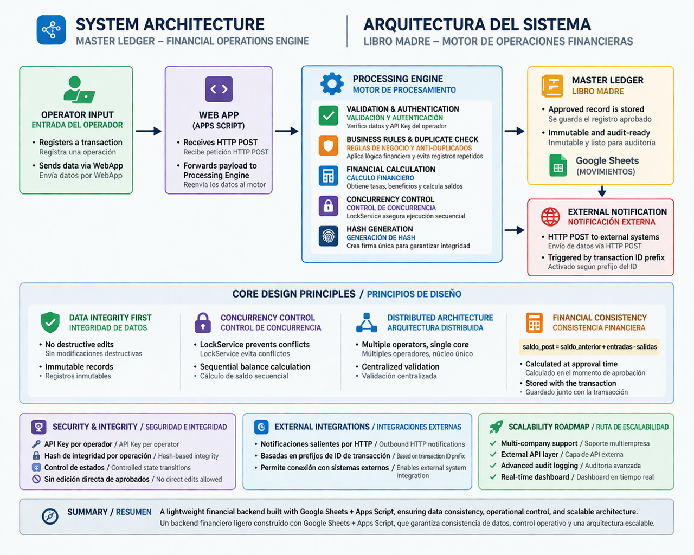

# 🧩 System Architecture

## Overview

The system is designed as a distributed financial operations engine where multiple operator sources send transactions to a centralized processing core (Master Ledger).

It ensures data consistency, controlled execution, and auditability of financial movements.

---

## 🔄 High-Level Flow
Operator Input → WebApp → Processing Engine → Master Ledger

### Flow Description:

1. Operator registers a transaction
2. Data is sent via WebApp (Apps Script endpoint)
3. The processing engine:
   - Validates the request
   - Applies business rules
   - Calculates balances
   - Locks execution to prevent concurrency issues
4. Transaction is written to Master Ledger
5. Optional external notification is triggered

---

## 🧠 Core Design Principles

### 1. Data Integrity First

- No destructive edits allowed
- Approved records are immutable
- Sequential balance calculation per counterparty

---

### 2. Concurrency Control

The system uses `LockService` to ensure:

- No simultaneous writes
- No race conditions in balance calculation

---

### 3. Distributed Architecture

- Each operator works on independent input sources
- Centralized validation and consolidation
- Unique global transaction ID

---

### 4. Financial Consistency Model

Balances are calculated as:
saldo_post = saldo_anterior + entradas - salidas

- Calculated at approval time
- Stored as part of the transaction
- Prevents recalculation inconsistencies

---

## ⚙️ Processing Engine Responsibilities

The core function (`aprobarOperacion`) handles:

- Payload validation
- Authentication via API KEY
- Duplicate detection
- Rate and benefit resolution
- Transaction calculation
- Hash generation for integrity
- Writing to Master Ledger
- External system notification

---

## 🔐 Security & Integrity

- API Key per operator
- Hash-based transaction integrity
- Controlled state transitions
- No direct edits on approved data

---

## 🔌 External Integrations

The system supports outbound notifications via HTTP:

- Triggered based on transaction ID prefix
- Allows integration with external systems

---

## 📊 Scalability Considerations

Future improvements include:

- Multi-company support
- External API layer
- Advanced audit logging
- Real-time dashboards

---

## 🧭 Summary

This system is designed to behave like a lightweight financial backend, ensuring:

- Data consistency
- Operational control
- Scalable architecture using simple tools (Google Sheets + Apps Script)

---

# 🇪🇸 Arquitectura del Sistema

## 🧠 Descripción General

El sistema está diseñado como un motor de operaciones financieras distribuido, donde múltiples fuentes (operadores) envían transacciones a un núcleo central de procesamiento (Libro Madre).

Garantiza consistencia de datos, ejecución controlada y trazabilidad de los movimientos financieros.

---

## 🔄 Flujo General
Entrada Operador → WebApp → Motor de Procesamiento → Libro Madre

### Descripción del flujo:

1. El operador registra una operación  
2. Los datos se envían mediante WebApp (Apps Script)  
3. El motor de procesamiento:
   - Valida la información  
   - Aplica reglas de negocio  
   - Calcula saldos  
   - Bloquea ejecución para evitar concurrencia  
4. La operación se registra en el Libro Madre  
5. Se ejecuta notificación externa (opcional)  

---

## 🧠 Principios de Diseño

### 1. Integridad de Datos

- No se permiten modificaciones destructivas  
- Los registros aprobados son inmutables  
- Cálculo secuencial de saldo por contraparte  

---

### 2. Control de Concurrencia

Se utiliza `LockService` para:

- Evitar escrituras simultáneas  
- Prevenir inconsistencias en el cálculo de saldos  

---

### 3. Arquitectura Distribuida

- Cada operador trabaja en su propio origen de datos  
- Validación y consolidación centralizada  
- Identificador único global por operación  

---

### 4. Modelo de Consistencia Financiera
saldo_post = saldo_anterior + entradas - salidas

- Calculado en el momento de aprobación  
- Guardado como parte de la transacción  
- Evita inconsistencias futuras  

---

## ⚙️ Responsabilidades del Motor

La función principal (`aprobarOperacion`) se encarga de:

- Validar datos de entrada  
- Autenticar mediante API KEY  
- Detectar duplicados  
- Resolver tasas y beneficios  
- Calcular la operación  
- Generar hash de integridad  
- Registrar en Libro Madre  
- Notificar sistemas externos  

---

## 🔐 Seguridad e Integridad

- API Key por operador  
- Hash de integridad por operación  
- Control de estados  
- Sin edición directa de registros aprobados  

---

## 🔌 Integraciones Externas

El sistema permite notificaciones vía HTTP:

- Basadas en prefijos de ID  
- Permite integración con sistemas externos  

---

## 📊 Escalabilidad

Mejoras futuras:

- Soporte multiempresa  
- API externa  
- Auditoría avanzada  
- Dashboard en tiempo real  

---

## 🧭 Resumen

Este sistema funciona como un backend financiero ligero, asegurando:

- Consistencia de datos  
- Control operativo  
- Escalabilidad usando herramientas simples (Google Sheets + Apps Script)
